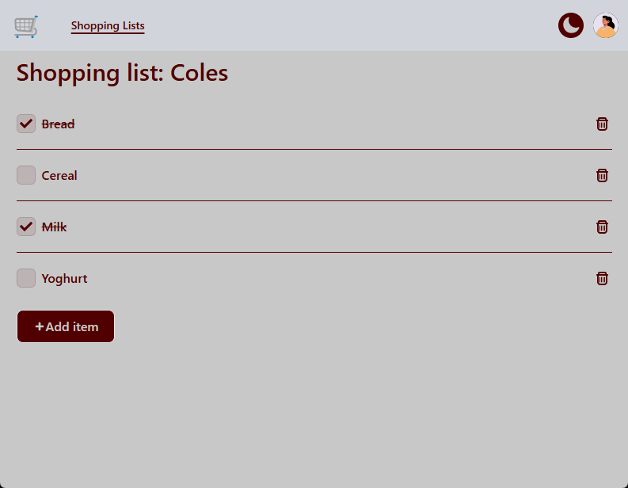
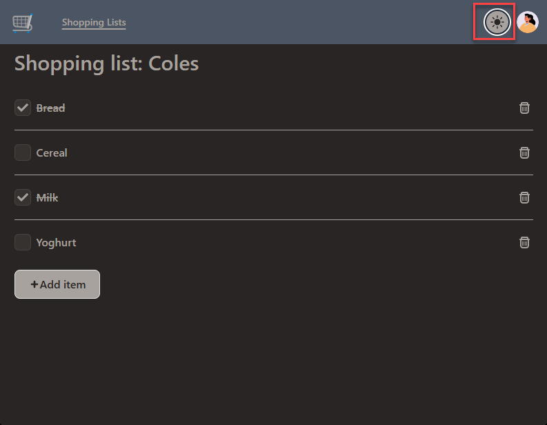

# EZ Shopping List

## Background

I wanted to experiment a bit with using Supabase as the backing store for a React developed Shopping List web app I created. You can try it out by logging in to the [web app](https://ez-shopping-list.vercel.app/) using the email `test@user.com` with password `testuser`.

## UI

The user is initially presented with their list of shopping lists. In the screenshot below, the shopping lists have been named according to the shop they're for, e.g. Coles for groceries to be bought at Coles, etc. The user can then add or delete shopping lists from this view.

On navigating into a shopping list, the list of shopping list items appear. You're able to add and delete items, or mark them off once in your shopping trolley.

There's also a dark-mode, as I wanted to experiment with Tailwind CSS a little. Below you can see that I've toggled dark mode.

